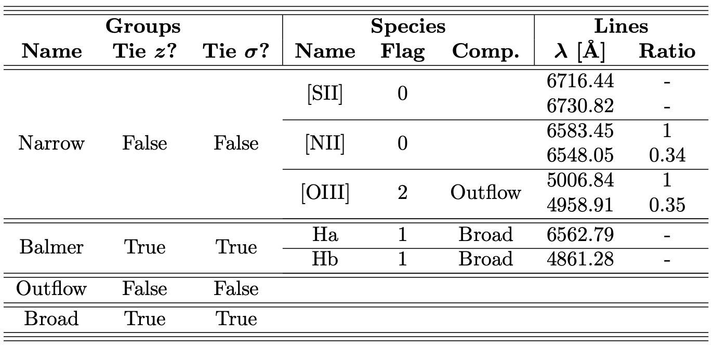

GELATO
========

*Galaxy/AGN Emission Line Analysis TOol by Raphael Hviding*
-------------

GELATO is a Python code designed to fit emission lines in the spectra of star forming galaxies and active galactic nuclei. In particular, it was built in order to fit spectra where many of the parameters of the emission lines are tied with respect to one another. GELATO attempts to automate this process. For example, tying the redshifts of AGN lines (e.g. OIII, NII) together, and the flux ratios of the lines therein, but keeping that separate from the redshifts of galaxy lines (e.g. Balmer series lines).

GELATO was also built in order to test the inclusion of additional fitting parameters. For example, is the spectrum better fit with a broad Halpha component? Or an outflowing OIII component? GELATO builds a base model based on the spectrum, and iteratively tests whether different additional components are justified to add to the model, based on an F-test and then comparisons of Akaike Information Criteria.

The spectra are fit using a Levenberg–Marquardt non-linear least squares algorithm with Gaussian line profiles.

GELATO was designed to be run on SDSS spectra, but the code can be adapted to run on other spectra.

Requirements
-------------

GELATO was developed using Astropy 3.2.3 and Python 3.6.10.

To install the dependancies, I recommend installing conda (through [Miniconda](https://docs.conda.io/en/latest/miniconda.html)).

A conda environment with nearly all the dependencies can be installed via the provided "environment.yml" file. If you do not wish to use conda, you can find the required version of python packages enumerated in the "environment.yml" file.

```bash
cd /path/to/GELATO/directory
conda env create -f environment.yml
```

The environment will then be installed under the name GELATO and can then be activated.

```bash
conda activate GELATO
```

Whenever running GELATO scripts, they must be run from this environment.

The final dependency is [Spectres](https://spectres.readthedocs.io/en/latest/) which can be installed by cloning the git repository or with pip.

```bash
conda activate GELATO
pip install spectres
```

Installation
-------------

First, clone the GELATO git repository. Then the GELATO scripts can be installed. Make sure you are in the GELATO conda environment.

```bash
cd /path/to/GELATO/directory
conda activate GELATO
python setup.py install
```

In your working directory, **you need to copy the "matplotlibrc" file** to control the plotting settings. This is most important if you are running GELATO with multiprocessing as this file sets the matplotlib backed to "Agg", a non-interactive backend, required for generating and saving figures on multiple threads.

How it works
-------------

1. Gathering Ingredients: First, the spectrum is loaded. The code assumes the spectrum file follows the SDSS format. Here, based on the emission line dictionary and redshift provided, the code determines which emission lines actually lie inside the domain of the spectrum. The region free from emission lines is then determined which will be used to obtain the initial fit to the continuum.

2. Creating Base (Continuum): GELATO models the continuum as a combination of Simple Stellar Populations (SSPs) from the [Extended MILES stellar library](http://research.iac.es/proyecto/miles/). We take SSP models assuming a Chabrier IMF (slope=1.3), the isochrones of Girardi et al. (2000) (Padova+00) with solar alpha abundance, and spanning a range of representatives metallicities and ages ([M/H] = [-1.31, -0.40, 0.00] and Age = [00.0631, 00.2512, 01.0000, 04.4668, 17.7828] (Gyr)) with nominal resolutions of 5 AAngstroms. The redshift of the continuum is assumed to be the input redshift and the SSP models are fit to the region of continuum free from emission lines. The coefficiencts for the SSP models are constrained to be positive. Following the initial fit, an additional power law component is added, required to have a negative power law index and a positive coefficient. If the continuum model with a power law passes an F-Test for its inclusion, it is added to the model.

3. Creating Base (Emission Lines): The emission line models are then constructed based on the emission line dictionary. The starting values are generated based on the spectrum by looking at the range of values where the emission line would be expected to lie. The model flux is reasonable bounded based on these values, and the redshift of the line is bounded to be within 0.005 of it's starting value. The model is then fit to the spectrum.

4. Adding Flavor: The additional components are then added to the base model and tested separately. If the fit is statistically better with the additional component, it is accepted. This is decided by performing an F-test. The combinations of all accepted additional components are then then tested by measuring their Akaike Information Criteria (AICs). The model set with the lowest AIC is the final model.

5. Scooping Portions: In order to constraint fit uncertainties, the flux is bootstrapped with respect to provided uncertainties and the fit is run again.

6. Presenting gelato: Figures depicting the fit, for the entire spectrum and zoomed into specific lines, are then saved to disk.

7. Measuring texture: From the results, the rest equivalent width for each emission line is calculated. The height of the continuum is found by taking the median continuum in a region around the emission line.

8. Freexing results: The full set of bootstrapped parameters are saved to disk.

9. Combining gelato: If running on multiple objects, the median parameters and standard deviations for all of the fits are concatenated into one file and saved to disk.
Models
-------------

* Emission Line Model: Emission lines are modeled as Gaussians parametrized with a redshift, a flux, and a dispersion (in km/s). They are forced to have a positive flux. The default value of the velocity dispersion of the line is set to 150 km/s, while it is bounded between 60 km/s and 500 km/s. This default can be adjusted in the "CustomModels.py" file.

* Continuum SSP Model: The continuum is modeled as the sum of E-MILES SSP models. In total, 15 SSP models are used to build a continuum. The normalization coefficients are named for each SSP model.

* Continuum Power Law Model: An additional power law continuum is attempted to be fit in addition to the SSP models. It is parametrized with a power law index, a normalization coefficient, and a scale (y = coeff*(x/scale)**(-index)). The scale is set by the wavelength range of the spectrum and is not a fitted parameters.

Additional Components
-------------

The current supported additional components are:

1. Broad Component: The broad components are modeled as Gaussians. They are forced to have a positive flux. The default value of the velocity dispersion of the line is set to 1000 km/s, while it is bounded between 750 km/s and 10000 km/s.
2. Outflow Component: They are forced to have a positive flux. The outflow components are modeled as Gaussians. The default value of the velocity dispersion of the line is set to 500 km/s, while it is bounded between 500 km/s and 1000 km/s.
3. Absorption Component: The outflow components are modeled as Gaussians. They are forced to have a negative flux. The default value of the velocity dispersion of the line is set to 600 km/s, while it is bounded between 350 km/s and 3000 km/s.

In order to have GELATO attempt to fit an emission line with an additional component, the line must be flagged in the parameters file, described in the section below. The flag is an integer, whose bitwise digits describe if a specific additional component should be tried. Examples for all possible combinations are given in the figure following the description of the EmissionGroups parameter.

Parameter File
-------------

The behaviour of GELATO is controlled entirely by the "PARAMS.json" file. And example parameter file is included in the repository.

* Outfolder: This parameter is the path to the output directory.
* VacuumWav: Are the spectra being fit in air or vacuum wavelengths.  
* ContinuumRegion: The border around emission lines in velocity space that will be excluded when fitting the continuum initially. 
* LineRegion: The border around an emission line in velocity that must be contained within the spectrum in order to be fit (km/s). This region is also used to estimate the initial height of the line.
* MaxIter: Maximum number of minimization algorithm iterations.
* NBoot: Number of bootstrap iterations to constrain error on parameters.
* FThresh: F-test threshold to incorporate additional model parameters.
* NProcess: Number of processes to open with python multiprocessing. Set equal to 1 to use only a single thread.
* Plotting: Produce plots or not.
* CalcEW: To calculate (rest) equivalent widths or not.
* Concatenate: To concatenate the results of a multiple GELATO run or not.
* Overwrite: Overwrite the results of a previous GELATO run.
* Verbose: To print GELATO output.
* EmissionGroups: Dictionary of emission lines to be fit by GELATO. The structure of this dictionary is crucial to the operation of GELATO. The following section details the format of this dictionary.

Emission Line Dictionary
-------------

Here we describe the format of the emission line dictionary.

1. The emission groups dictionary is made up of Groups. All spectral features in the same group can be set to share a common redshift, a common dispersion, or neither.  This means, during fitting, their redshifts or dispersions can be forcibly tied to be equal.

      * Each group has a Name, which controls how its parameters appear in the output.
      * Each group has TieRedshift flag, which controls if the redshifts of all the group elements are tied or not.
      * Each group has TieDispersion flag, which controls if the dispersions of all the group elements are tied or not.
      * Finally, each group is made out of a list of species.

2. Each Group contains a list of Species. All spectral features in the same Species will share a redshift velocity and dispersion. This means, during fitting, their velocity dispersions and redshifts will be forcibly tied to be equal.

      * Each species has a name, which controls how its parameters appear in the output.
      * Each species has a Flag. The integer flag controls will additional parameters GELATO will attempt to add to the spectral features of this species. The value in each bit, from right to left (increasing order of magnitude), is a boolean flag for each kind of additional component, which can be found in the Additional Components section of the README and the "AdditionalComponents.py" file.
      * Each species has a FlagGroup. Each additional component must be associated with a Group, which may or may not be the same Group as the original species. An additional list is passed to each species, specifying where each additional component that will attempt to be added must go. The group must exist, even if empty, as it needs to be created with the flags. (Note: This means the sum of the bits of the flag must be equal to the length of the FlagGroups list.)

3. Each Species contains a list of lines. Lines can be set to have relative fluxes.  This means, during fitting, their fluxes will be tied to have the given relative values.

      * Lines have a Wavelength. This is the rest wavelength of the line (same units as spectrum wavelength).
      * Lines have a RelStrength. This is a relative strength to the other members of the species. If set to null, it will have an independent flux.

The "PARAMS.json" file in the directory gives a good example of how to take advantage of these features. It consists of four groups:

1. Name: Narrow. Here these features have not been set to share redshifts nor dispersions. It has a list of species:
   1. Name: SII. These features will share the same velocity dispersion and redshift. There are no flags on this component, so the list is empty. It is made out of two lines.
      * A line with a rest wavelength of 6716.44 and a relative flux of null.
      * A line with a rest wavelength of 6730.82 and a relative flux of null. This means the line fluxes are completely independent.
   2. Name: NII. These features will share the same velocity dispersion and redshift. There are no flags on this component, so the list is empty. It is made out of two lines.
      * A line with a rest wavelength of 6583.45 and a relative flux of 1.
      * A line with a rest wavelength of 6548.05 and a relative flux of 0.34. This means this line will always have 0.34/1 times the flux of the first line.
   3. OIII. These features will share the same velocity dispersion and redshift. These have been flagged with a 2, or in binary 10. This corresponds to an "Outflow" component. This additional component will be placed the group named "Outflow". It is made out of two lines.
      * A line with a rest wavelength of 5006.84 and a relative flux of 1.
      * A line with a rest wavelength of 4958.91 and a relative flux of 0.35. This means this line will always have 0.35/1 times the flux of the first line.
2. Name: Balmer. Here these features are set to share redshifts and dispersions. It has a list of species:
   1. Ha. A singlet line flagged with a 1, which corresponds to a "Broad" component. This additional component will be placed the group named "Broad". It is made out of one line.
      * A line with a rest wavelength of 6562.79 and a relative flux of null.
   2. Hb. These have been flagged with a 1, which corresponds to a "Broad" component. This additional component will be placed the group named "Broad". It is made out of one line.
      * A line with a rest wavelength of 4861.28 and a relative flux of null.
3. Name: Outflow. This is an empty group as it may receive additional components from other groups. If more than one component lands in this group, they will not share redshifts and dispersions.
4. Name: Broad. This is an empty group as it may receive additional components from other groups. If more than one component lands in this group, they will share redshifts and dispersions. E.g. if both "Broad" lines are accepted (from Hbeta and Halpha), they will share the same redshift and dispersion by design.

Here is table showing the hierarchy of the Emission Groups Parameter for the "PARAMS.json" file. A script is provided that can turn a Emission Groups dictionary in a Parameter file into a LaTeX table.



Running GELATO
-------------

In order to run GELATO you need:

* The PARAMS.json file.
* The spectrum or spectra.
* The redshift of each spectrum. The redshift of the object must be passed to construct the spectrum object. While the redshift is a fitted parameter, the provided value must be correct to at least 1 part in 100. A basic estimate from the apparent position of any identified emission line should suffice. Ideally this is the redshift of the continuum as the redshift of the continuum is not fit.
* If running on a list of spectra, GELATO takes in a comma delimited file, where each object occupies a different line. The first item in each line is the path to the spectrum. The second is the redshift of the spectrum.
* (If plotting) the matplotlibrc file in your working directory, especially if you are running on multiple threads, in which case the non-interactive backend must be specified.

All of the following scripts can be made into executables and simply called directly.

The two wrappers for GELATO are:

* "run_GELATO_single.py"

   This script is designed to run GELATO over a single object. This takes 3 positional arguments, the path to the parameters file, the path to the spectrum, and the redshift of the object.

  ```bash
  python ~/Documents/GELATO/run_GELATO_multi.py ~/Example/PARAMS.json ~/Data/spectrum.fits 1.122
  ```

* "run_GELATO_multi.py"

   This script is designed to run GELATO over a list of objects. This takes 2 positional arguments, the path to the parameters file, and the path to the list of objects.

```bash
python ~/Documents/GELATO/run_GELATO_multi.py ~/Example/PARAMS.json ~/Data/spectra_with_redshifts.txt
```

Optionally, equivalent widths and plots can be generated when running GELATO. However, if you opt out of creating them during the run, you can always create them after using specific GELATO modules.

For a single plot:

```bash
python ~/Documents/GELATO/gelato/Plotting.py ~/Example/PARAMS.json --Spectrum ~/Data/spectrum.fits --Redshift 1.122
```

For multiple plots:

```bash
python ~/Documents/GELATO/gelato/Plotting.py ~/Example/PARAMS.json --ObjectList ~/Data/spectra_with_redshifts.txt
```

To generate equivalent widths and append them to the results file is similar to plotting:

```bash
python ~/Documents/GELATO/gelato/EquivalentWidth.py ~/Example/PARAMS.json --Spectrum ~/Data/spectrum.fits --Redshift 1.122
```

```bash
python ~/Documents/GELATO/gelato/EquivalentWidth.py ~/Example/PARAMS.json --Spectrum ~/Data/spectrum.fits --Redshift 1.122
```

The concatenated results for GELATO can also be created directly the results files in the following manners:

```bash
python ~/Documents/GELATO/gelato/ConcatResults.py ~/Example/PARAMS.json ~/Data/spectra_with_redshifts.txt
```

Running the Example

-------------
Here are the following instructions to run GELATO. This tutorial assumes you start in the Example directory. First we need to activate our GELATO environment.

```bash
conda activate GELATO
```

We can then run the code over the whole data set.

```bash
python ../run_GELATO_multi.py ExPARAMS.json ExObjList.csv
```

The output from running the example will be put into 'Results/' and can be compared to the results in the 'Comparison/' directory.

GELATO cast (in order of appearance)

-------------

* README.md
  
  Here you are! The documentation for GELATO.

* run_GELATO_single.py
  
  Wrapper for running GELATO on a single object.
  
* run_GELATO_multi.py
  
  Wrapper for running GELATO on multiple objects. If specifying multiple processes, each object will be run on an independent thread. To load an object file differently, this file should be edited.

* params_to_tex.py
  
  Convenience function for turning Parameters file (specifically the emission line dictionary) into a LaTeX table for easy inclusion in publications using this code.

* PARAMS.json
  
  Paramter file that controls GELATO behavior.

* ConstructParams.py

  Routines for turning the PARAMS.json file into a python dictionary, and verifying that it is in the correct format.

* GELATO.py

  Main GELATO function that calls and coordinates the whole operation.

* SpectrumClass.py

  A class the defines how a spectrum is loaded. GELATO was designed for SDSS spectra. To load in any other kind of spectrum, you can edit the way this class is initialized.

* BuildModel.py

  This file handles the construction of models and for tying the various parameters together as outlined by the emission line dictionary.

* CustomModels.py

  Here are where the custom models used in GELATO are defined. Here exists a gaussian emission line model, the SSP continuum, and the power law continuum. The parameters for each model are defined with respect to the rest frame, but the output of the model is in the observed frame. This is where the velocity width limits on emission features can be set.

* AdditionalComponents.py

  Here are where the additional components are defined along with their bit flag positions. In order to add extra additional components, this file can be easily extended to include more models. This is where the velocity dispersion limits on additional components can be modified.

* FittingModel.py

  Here are the scripts for fitting GELATO generated models and for testing the inclusion of additional parameters. To change the fitting algorithm, this file can be edited.

* ModelComparison.py

  Here are scripts for model comparison and selection, including F-Tests and AIC calculation.

* Plotting.py

  Here are the scripts for creating and saving figures of the fits. Can also be run directly on GELATO results in order to create figures after the fact. The plots can either be plotted as the components or the final result only.

* EquivalentWidth.py

  Here are the scripts for creating and saving emission line EW. Can also be run directly on GELATO results in order to generate EW after the fact. Rest equivalent widths are generated by assuming a flat continuum at the height of the continuum at the emission line center.

* ConcatenateResults.py

  Scripts for concatenating results from a multi GELATO run. Can also be run independently on results after the fact.

* matplotlibrc

  A matplotlib settings file that controls the output of figures. Can be changed to the user's liking. However, for running GELATO on multiple threads, the backend must be set to a non-interactive backend, e.g. "Agg".

* LICENSE

  Code license, GELATO is distributed under the GNU General Public License 3.

License

-------------
GELATO is an open-source software available under the GNU General Public License 3. In a nutshell, this code can be used and distributed by anyone, but any code that includes GELATO must also be distributed freely and openly (see LICENSE file for details).

FAQ

-------------
**How can I load spectra from other sources?**

*By editing the SpectrumClass.py file, you can customize how spectra are loaded into GELATO. However it might be easier to convert your spectrum to follow the SDSS convention.*

**What are the units?**

*ContinuumRegion and LineRegion are quoted velocity space and are given in km/s. Otherwise, the code is agnostic to the flux and wavelength units. However the plots assume the SDSS units. Currently the labels can only be changed in the Plotting.py file. Reach out if you would want this to be customizable from the PARAMS file and I can add it to GELATO. The wavelength units for line centers must be given in the same units as the spectrum.*

**Do you mean velocity offsets, not redshifts?**

*Each emission line is characterized by a redshift, which is trivial to convert to a velocity offset once a reference line is chosen. However this requires the user to choose a reference line. GELATO remains agnostic to this procedure and simply returns the redshift of each line.*