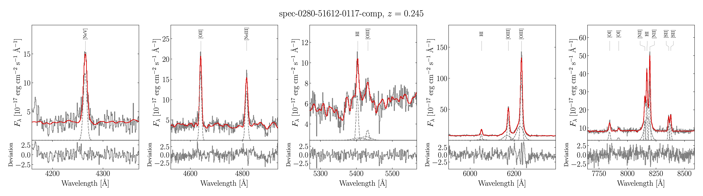
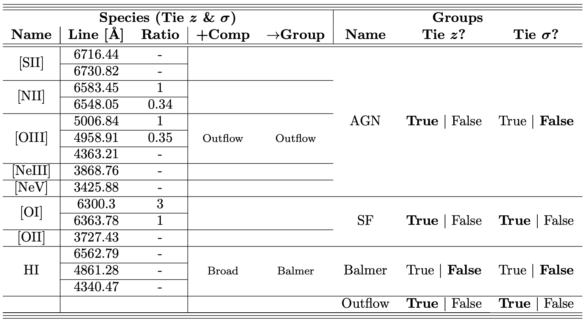

GELATO
========




*Galaxy/AGN Emission Line Analysis TOol by Raphael Hviding*
-------------

GELATO is a Python code designed to retrieve the kinematics and line fluxes of emission lines from optical spectroscopy of star-forming galaxies and active galactic nuclei. It was designed to allow the user to tie the emission line parameters of associated emission lines to represent the physical conditions present in these galaxies. For example, tying the redshifts of the Balmer lines to each other, or setting the flux ratio of the [OIII] doublet to a specific value. This is done in a flexible way so that any physical scenario can be represented using GELATO. In addition, GELATO is designed to fit additional components to lines with complex kinematics. For example, is the spectrum better fit with a broad Halpha component? Or an outflowing OIII component? Based on user specifications, GELATO will attempt to fit these components and, using a quality check, can determine if they are required to fit the spectrum. 

Table of Contents
-------------

* [Dependecies](#Dependencies)
* [Installation](#Installation)
* [Updating GELATO](#Updating-GELATO)
* [GELATO at a Glance](#GELATO-at-a-glance)
* [Running GELATO](#Running-GELATO)
* [Running the Example](#Running-the-Example)
* [Results File](#Results-File)
* [Parameter File](#Parameter-File)
* [Emission Line Dictionary](#Emission-Line-Dictionary)
* [GELATO in Depth](#GELATO-in-Depth)
* [Model Descriptions & Limits](#Model-Descriptions-&-Limits)
* [Additional Components](#Additional-Components)
* [License](#License)
* [FAQ](#FAQ)

## Dependencies

GELATO is built with Python 3.9 and requires the following packages:
* NumPy
* SciPy
* Astropy

and any dependecies therein. This is the minimum set of packages that must be installed to run GELATO.

However, to retrieve plots from GELATO, matplotlib must be installed, and a version of LaTeX must be available as well.

In addition, an example Jupyter notebook is provided to demonstrate the capabilities of GELATO. In order to use this notebook, the jupyter package must be installed as well.

Installing the Python dependencies is detailed in the Installation portion of this guide. LaTeX can be installed following the instructions [here](https://www.latex-project.org/get/).

## Installation

To install GELATO, begin by cloning the GELATO git repository. If you have not used git before, this is done by using the following commands to clone the directory over HTTPS.

```bash
cd /path/to/insallation/directory
git clone https://github.com/TheSkyentist/GELATO.git
```

To install the dependancies, I recommend installing conda (through [Miniconda](https://docs.conda.io/en/latest/miniconda.html)).

A conda environment with nearly all the dependencies can be installed via the provided "environment.yml" file. If you do not wish to use conda, you can install the dependencies enumerated in the "environment.yml" file.

```bash
cd /path/to/GELATO/directory
conda env create -f environment.yml
```

The environment will then be installed under the name GELATO and can then be activated.

```bash
conda activate gelato
```

Whenever running GELATO scripts, they must be run from this environment.

Then the GELATO scripts can be installed. Make sure you are in the GELATO conda environment.

```bash
cd /path/to/GELATO/directory
conda activate gelato
python setup.py install
```

In your working directory, **you need to copy the "matplotlibrc" file** to control the plotting settings. This is most important if you are running GELATO with multiprocessing as this file sets the matplotlib backed to "Agg", a non-interactive backend, required for generating and saving figures on multiple threads.

## Updating GELATO

In order to update GELATO, you need to update the core packages, pull from the repo, and reinstall GELATO to your path. 

```bash
conda update -n gelato --all
cd /path/to/GELATO/directory
git pull
conda activate gelato
python setup.py install
```

In the case where a new version of GELATO releases where there are more strict dependecies, you may need to fully delete GELATO and its associated conda environment and reinstall from scratch.

## GELATO at a Glance

In this section we describe the operation of GELATO at a high level.

1. Gathering Ingredients: The spectrum is loaded and, based on the input parameters file, GELATO determines which emission lines are in the wavelength range of the spectrum. The emission lines are then masked. If there are additional regions that should be masked in the spectrum, either due to telluric or spectral features, this should be done before passing the spectrum to GELATO.

2. Creating Base: GELATO models the continuum of the masked spectrum as a non-negative linear combination of Simple Stellar Populations (SSPs) from the [Extended MILES stellar library](http://research.iac.es/proyecto/miles/) (E-MILES). In addition, GELATO tests for the inclusion of a power-law component. During this step, the redshift of the continuum models is allowed to vary and is fixed following the final fit of the continuum. The spectrum is unmasked and a single Gaussian is added for each emission line in the input parameter file.

3. Adding Flavor: Additional line components for each emission line as specified in the input parameter file are tested. The final model is constructed from the continuum model, the base emission lines, and the accepted set of additional components. 

4. Scooping Portions: In order to constraint fit uncertainties, the flux is bootstrapped with respect to provided uncertainties and the fit is run as many times as specified by the input parameters file.

5. Presenting gelato: (Optional) Three figures depicting the final fit to the data are generated and saved to disk.

6. Measuring Texture: (Optional) The rest equivalent width of the emission line components are measured.

7. Freezing results: The results of the fit are saved to disk. Along with any additional parameters measured.

8. Combining GELATO: (Optional) If GELATO is running on multiple objects, the results from each object are averaged and combined into one convinient file. 

## Running GELATO

In order to run GELATO you need:

* The parameters file, a JSON file, the format of which is described [below](#Parameter-file). An example JSON file is also provided.
* The spectrum or spectra. The log10 of the wavelength in Angstroms of the spectrum must be provided along with the spectral flux density per unit wavelength (Flam). The inverse variance of the fluxes, in corresponding units, must also be provided.
* The redshift of each spectrum. The redshift of the object must be passed to construct the spectrum object. While the redshift is a fitted parameter, the provided value must be correct to at least 1 part in 200, preferable 1 part in 1000. A basic estimate from the apparent position of any identified emission line should suffice.
* If running on a list of spectra, GELATO takes either...
  * a comma delimited file (ending in .csv) where each object occupies a different line. The first item in each line is the path to the spectrum. The second is the redshift of the spectrum.
  * a FITS table (ending in .fits) where each object occupies a different entry in the table. The table must have the column "Path" for the path to the object, and "z"
  containing the redshift of the object.
* (If plotting) the matplotlibrc file in your working directory, especially if you are running on multiple threads, in which case the non-interactive backend must be specified.

Currently, the best way to run GELATO is using the wrapper scripts in the in the Convenience subdirectory. The scripts are executable and can be called directly. Ensure that you are in the GELATO conda environment before running any of the scripts. These scripts can be copied to your working directory.

There are two wrappers for GELATO, one for running on a single spectrum, and one for running on a list of spectra.

* "run_GELATO_single.py"

   This script is designed to run GELATO over a single object. This takes 3 positional arguments, the path to the parameters file, the path to the spectrum, and the redshift of the object (in this example, 0.5). You can copy this file into your working directory once GELATO has been installed into the conda environment.

  ```bash
  python run_GELATO_single.py PARAMS.json spectrum.fits 0.5
  ```

* "run_GELATO_multi.py"

   This script is designed to run GELATO over a list of objects. This takes 2 positional arguments, the path to the parameters file, and the path to the list of objects. You can copy this file into your working directory once GELATO has been installed into the conda environment. While it is called multi, it can be run on a file containing a single object.

  ```bash
  python run_GELATO_multi.py PARAMS.json spectra_with_redshifts.csv
  ```

During a GELATO run, rest equivalent widths and plots can be generated depending on what is specified in the parameter file. However, if you opt out of creating them during the run, you can always create them after using the following scripts located in the Convinience subdirectory. These scripts can be copied to the working directory after the installation. Similarly, these scripts are executable and can be called directly.

* "Plot_from_results.py":

  ```bash
  # For a single plot
  python Plot_from_results.py PARAMS.json --Spectrum spectrum.fits --Redshift 0.5
  ```

  ```bash
  # For multiple plots
  python Plot_from_results.py PARAMS.json --ObjectList spectra_with_redshifts.csv
  ```

* "EW_from_results.py"

  ```bash
  python EW_from_results.py PARAMS.json --Spectrum spectrum.fits --Redshift 0.5
  ```

  ```bash
  python EW_from_results.py PARAMS.json --Spectrum spectrum.fits --Redshift 0.5
  ```

The concatenated results, with median parameters and standard deviations, for GELATO can also be created directly the results files in the following manner:

* "Concat_from_results.py"

  ```bash
  python Concat_from_results.py PARAMS.json spectra_with_redshifts.csv
  ```

## Running the Example

We provided an example for running GELATO on a few SDSS spectra. This tutorial assumes you start in the Example directory. First we need to activate our GELATO environment.

```bash
conda activate gelato
```

We can then run the code over the whole data set.

```bash
python ../Convenience/run_GELATO_multi.py ExampleParameters.json ExampleObjList.csv
```

The output from running the example will be put into 'Results/' and can be compared to the results in the 'Comparison/' directory.

While GELATO is designed to be run in this fashion, an IPython notebook is provided in the Example directory. This can also help with how to access GELATO output.

## Results File

The results are presented in a file with the name of the spectrum and ending with "-results.fits". It is a multi extension FITS file. Each extension is named based on its contents and can be retrieved in the following manner:
```python
from astropy.io import fits
print(fits.open('example-results.fits').info())
```
The extensions are:

* SUMMARY: It is a binary FITS table containing the summary of the models. It contains the original spectrum without the bad data points (ivar == 0) along with the total model, ssp continuum, power-law continuum, emission-line model generated from the median parameters. The latter two columns will not appear if they are not included in the final fit of the spectrum.
* PARAMS: It is a binary FITS table where each column represents a parameter with a row for each bootstrap. Redshift and dispersion measurements are given in km/s. Flux measurements are dependent on the input units of the spectrum. In addition, the rest amplitude (RAmp) of the Gaussian is also returned as this can be a more reliable way for computing line detection. If calculated, rest equivalent widths are given in Angstroms. Coefficients on the SSP continuum models are in the units of the SSP models.

In addition, if running on multiple spectra, GELATO can optioanlly create a file named "GELATO-results.fits". For each object, the median of the resulting parameters and standard devation across the bootstraps are taken and concatenated into a single file for convinence.

## Parameter File

The behavior of GELATO is controlled by the JSON parameters file. The JSON parameter file can be edited as plain text but must conform to the JSON standards. It roughly consists of a dictionary where each of the following parameters must be specified. An example parameter file is included in the Example directory.

* Outfolder: This parameter is the path to the output directory.
* VacuumWav: Are the spectra being fit in air or vacuum wavelengths.  
* RandomSeed: The seed used as input to NumPy for random number generation.
* ContinuumRegion: The border around emission lines in velocity units (km/s) that will be excluded when fitting the continuum initially.
* LineRegion: The border around an emission line in velocity units (km/s) that must be contained within the spectrum in order to be fit. This region is also used to estimate the initial height of the line.
* NBoot: Number of bootstrap iterations to constrain error on parameters.
* FThresh: F-test threshold to incorporate additional model parameters.
* NProcess: Number of processes to open with python multiprocessing. Set equal to 1 to use only a single thread.
* Plotting: Produce plots or not.
* FlamUnits: String containing the units of the spectrum flux for purposes of plotting, can accept LaTeX syntax.
* CalcEW: To calculate (rest) equivalent widths or not.
* Concatenate: To concatenate the results of a multiple GELATO run or not.
* Overwrite: Overwrite the results of a previous GELATO run.
* Verbose: To print GELATO output.
* EmissionGroups: Dictionary of emission lines to be fit by GELATO. The structure of this dictionary is crucial to the operation of GELATO. The following section details the format of this dictionary.

## Emission Line Dictionary

GELATO uses a hierarchical approach to represent the physical relationship between emission line species and components. GELATO first associates individual emission lines, characterized by a central wavelength, with a *Species*. For example, all Balmer emission lines would be characterized by a single *Species*, e.g. H I. Since all emission lines within a *Species* come from the same physical source, their kinematics are tied together, e.g. their redshifts and velocity dispersions are required to be the same value, respectively. In addition, a flux ratio can be specified for emission lines whose relative intensities are fixed. The various *Species* are then distributed into *Groups*. *Groups* embody assumptions made between their various component *Species*. The user can decide whether *Species* in a *Group* are required to have their velocity dispersion or redshifts fixed to the same value, respectively. In summary, *Groups* contain *Species*, which can optionally share kinematic properties, while *Species* contain emission lines that must share kinematic properties. 

For each *Species*, the user can also specify which additional components should be tested for their inclusion. Any combination of the supported additional components can be specified for all *Species*. For each additional component specified, a *Group* must be specified that the additional component will be placed into. This allows for the additional component to have a different relationship with other *Species* than the parent *Species*. As a consequence, it allows the user to specify whether or not additonal components will have a velocity shift with respect to their narrow counterparts.

In this setion we detail the format of the emission line dictionary:

1. The emission groups dictionary is made up of Groups. All spectral features in the same group can be set to share a common redshift, a common dispersion, or neither.  This means, during fitting, their redshifts or dispersions can be forcibly tied to be equal.

      * Each group has a Name, which controls how its parameters appear in the output.
      * Each group has TieRedshift flag, which controls if the redshifts of all the group elements are tied or not.
      * Each group has TieDispersion flag, which controls if the dispersions of all the group elements are tied or not.
      * Finally, each group is made out of a list of species.

2. Each Group contains a list of Species. All spectral features in the same Species will share a redshift velocity and dispersion. This means, during fitting, their velocity dispersions and redshifts will be forcibly tied to be equal.

      * Each species has a name, which controls how its parameters appear in the output.
      * Each species has a Flag. The integer flag controls will additional parameters GELATO will attempt to add to the spectral features of this species. The value in each bit, from right to left (increasing order of magnitude), is a boolean flag for each kind of additional component, which can be found in the Additional Components section of the README and the "AdditionalComponents.py" file.
      * Each species has a FlagGroup. Each additional component must be associated with a Group, which may or may not be the same Group as the original species. An additional list is passed to each species, specifying where each additional component that will attempt to be added must go. The group must exist, even if empty, as it needs to be created with the flags. (Note: This means the sum of the bits of the flag must be equal to the length of the FlagGroups list.)

3. Each Species contains a list of lines. Lines can be set to have relative fluxes.  This means, during fitting, their fluxes will be tied to have the given relative values.

      * Lines have a Wavelength. This is the rest wavelength of the line (same units as spectrum wavelength).
      * Lines have a RelStrength. This is a relative strength to the other members of the species. If set to null, it will have an independent flux.

The "ExampleParameters.json" file in the Example directory gives a good example of how to take advantage of these features. This is not mean to represent a physically accurate sample, but to give an idea of all of the features of the code. It consists of four groups:

1. Name: AGN. Here we might put our AGN lines which in this case we want to share redshifts but we don't want to share dispersions. It has a list of species:
   1. Name: [SII]. These features will share the same velocity dispersion and redshift. There are no flags on this component, so the list is empty. It is made out of two lines.
      * A line with a rest wavelength of 6716.44 and its flux is left free.
      * A line with a rest wavelength of 6730.82 and its flux is left free. This means the line fluxes are completely independent.
   2. Name: [NII]. These features will share the same velocity dispersion and redshift. There are no flags on this component, so the list is empty. It is made out of two lines.
      * A line with a rest wavelength of 6583.45 and a relative flux of 1.
      * A line with a rest wavelength of 6548.05 and a relative flux of 0.34. This means this line will always have 0.34/1 times the flux of the first line.
   3. Name: [OIII]. These features will share the same velocity dispersion and redshift. These have been flagged with a 2, or in binary 10. This corresponds to an "Outflow" component. This additional component will be placed the group named "Outflow". It is made out of three lines.
      * A line with a rest wavelength of 5006.84 and a relative flux of 1.
      * A line with a rest wavelength of 4958.91 and a relative flux of 0.35. This means this line will always have 0.35/1 times the flux of the first line.
      * A line with a rest wavelength of 4363.21 and its flux is left free.
    4. Name: [NeIII]. A singlet line with no flags, so the list is empty.
      * A line with a rest wavelength of 3868.76 and its flux is left free.
    5. Name: [NeV]. A singlet line with no flags, so the list is empty.
      * A line with a rest wavelength of 3425.88 and its flux is left free.
2. Name: SF. Here these features are set to share redshifts and dispersions. It has a list of species:
   1. Name: [OI].  There are no flags on this component, so the list is empty. It is made out of two lines.
      * A line with a rest wavelength of 6300.3 and a relative flux of 3.
      * A line with a rest wavelength of 6463.78 and a relative flux of 1. This means this line will always have 1/3 times the flux of the first line.
   2. Name: [OII]. A singlet line with no flags, so the list is empty.
      * A line with a rest wavelength of 3727.43 and its flux is left free.
3. Name: Balmer. Here these features will not share redshifts and dispersions. It has a list of species:
   1. HI. These features will share the same velocity dispersion and redshift. These have been flagged with a 1, which corresponds to a "Broad" component. This additional component will be placed the group named "Balmer". It is made out of one line.
      * A line with a rest wavelength of 6562.79 and its flux is left free.
      * A line with a rest wavelength of 4861.28 and its flux is left free.
      * A line with a rest wavelength of 4340.47 and its flux is left free.
4. Name: Outflow
  If more than one component lands in this group, they will share redshifts and dispersions. E.g. if "Outflow" lines are accepted (i.e. from [OIII]), they will share the same redshift and dispersion by design.

Here is table showing the hierarchy of the Emission Groups Parameter for the "PARAMS.json" file. A script, params_to_TeX.py, is provided in the Convenience directory can turn a Emission Groups dictionary in a Parameter file into a LaTeX table.

  ```bash
  python params_to_TeX.py PARAMS.json
  ```



## GELATO in Depth

0. All fitting in GELATO is done using a [Trust Region Reflective](https://epubs.siam.org/doi/10.1137/S1064827595289108) bounded non-linear least-squares optimization algorithm.

1. Gathering Ingredients: First, the spectrum is loaded. The code assumes the spectrum file is a FITS table with the following columns and column names:
    1. The log10 of the wavelengths in Angstroms, column name: "loglam"
    2. The spectral flux density in flam units, column name: "flux"
    3. The inverse variances of the data points, column name: "ivar"

   Based on the emission line dictionary and redshift provided, the code determines which emission lines actually lie inside the domain of the spectrum. The region free from emission lines is then determined which will be used to obtain the initial fit to the continuum.

2. Creating Base: GELATO models the continuum as a combination of Simple Stellar Populations (SSPs) from the [Extended MILES stellar library](http://research.iac.es/proyecto/miles/). Note, since the continuum models have a minimum wavelength of 1680 Angstroms, there is a maximum wavelength that can be fit with GELATO based on the spectral coverage of the input spectra. The redshift is allowed to vary around the input redshift and the SSP models are fit to the region of continuum free from emission lines. The coefficients for the SSP models are constrained to be positive. 
Following the initial fit, an additional power law component is added. If the continuum model with a power law passes an F-test for its inclusion, it is added to the model. The redshift of the continuum model is frozen and not fit moving forward. Finally, the continuum is fit to the spectrum in the region without emission lines, if any of the SSP coefficients hit their lower limits (as determined by the TRF algorithm), the corresponding SSP is removed from the continuum model.
A single Gaussian is then added for each emission line. The starting values are generated based on the spectrum by looking at the range of values where the emission line would be expected to lie. The model is then fit to the spectrum.

3. Adding Flavor: The additional components are then added to the base model and tested separately. If the fit is statistically better (judged with an F-test) with the additional component and the additional component does not hit any of its parameter limits (as determined by the TRF algorithm), it is accepted. Every possible combination of all accepted additional components is then then tested and theirAkaike Information Criteria (AICs) are measured. If any combination has any of its constituent model components hit a limit, then its AIC is set to infinity. The model set with the lowest AIC is the final model. The model is then fit to the spectrum.

4. Scooping Portions: In order to constraint fit uncertainties, the flux is bootstrapped by randomly sampling each data point based on the associated inverse variance. The model is then fit to the bootstrapped spectrum with the fitted parameters from step 3 as input.

5. Presenting gelato: (Optional) A figure depicting the total fit to the entire spectrum and the total fit zoomed in on the emission lines are presented. In addition, a figure is presented zoomed in on the emission lines that presents all components fit to the lines.

6. Measuring Texture: (Optional) The rest equivalent width of the emission line components are measured for each of the boostraps. This is not a full integration of the continuum and approximates the height of the continuum as the median continuum flux within a small region around the line center.

7. Freezing results: The results of the fit are saved to disk. Along with any additional parameters measured.

8. Combining GELATO: (Optional) If GELATO is running on multiple objects, the results from each object are averaged and combined into one convinient file. 

## Model Descriptions & Limits

* Emission Line Model: Emission lines are modeled as Gaussians parametrized with a redshift (km/s), a flux, and a dispersion (km/s). The dispersion represents the standard devation of the Gaussian. The flux is bounded symmetrically based on the range of values in the spectrum near the line centroid. The default value of the dispersion is set to the median narrow line dispersion of the [Mullaney et al. 2013](https://ui.adsabs.harvard.edu/abs/2013MNRAS.433..622M/abstract) sample of 130 km/s. It has a lower bound of 60 km/s corresponding to the maximum SDSS resolution of 2500. It has an upper bound of 500 km/s corresponding to the delineation between narrow lines and broad lines at a FWHM of 1200 km/s used in [Hao et al. 2005](https://ui.adsabs.harvard.edu/abs/2005AJ....129.1783H/abstract). The redshift of the narrow line Guassians is allowed to vary by +/-300 km/s based on the [Mullaney et al. 2013](https://ui.adsabs.harvard.edu/abs/2013MNRAS.433..622M/abstract) sample where 98% of the narrow line redshift offsets fall within this range.

These defaults can be adjusted in the "CustomModels.py" file. 

* Continuum SSP Model: The continuum is modeled as the sum of E-MILES SSP models. In total, 15 SSP models are used to build a continuum. The normalization coefficients are named for each SSP model. We use SSP models assuming a Chabrier IMF (slope=1.3), the isochrones of Girardi et al. (2000) (Padova+00) with solar alpha abundance, and spanning a range of representatives metallicities and ages ([M/H] = [-1.31, -0.40, 0.00] and Age = [00.0631, 00.2512, 01.0000, 04.4668, 12.5893] (Gyr)) with nominal resolutions of 5 Angstroms. The models that are loaded in are specified in the continuum_models.txt file in the SSPs directory. When first fitting the continuum, the continuum models are allowed to vary by +/- 300 km/s before being fixed. 

* Continuum Power Law Model: An additional power law continuum is attempted to be fit in addition to the SSP models. It is parametrized with a power law index, a normalization coefficient, and a scale (y = coeff*(x/scale)**(-index)). The power law index has a default value of 1.5. The scale is set as the 20th percentile of the wavelength values for which there is a good flux value. i.e. np.nanpercentile(10**loglam[ivar > 0],20). The coefficient has a lower bound of zero with no upper bound and the power law index has no bounds.

## Additional Components

The current supported additional components are:

1. Broad Component: The broad components are modeled as Gaussians. They are identical to the regular emission line models except for a few key differences. The dispersion has a lower bound of 500 km/s corresponding to the delineation between narrow lines and broad lines at a FWHM of 1200 km/s used in [Hao et al. 2005](https://ui.adsabs.harvard.edu/abs/2005AJ....129.1783H/abstract) and an upper bound of 6,500 km/s which encompasses 99% of all Ha and Hb broad line dispersion velocities in the [Shen et al. 2011](http://adsabs.harvard.edu/abs/2011ApJS..194...45S) sample. The starting value is set to 1600 km/s based on the median values in the [Shen et al. 2011](http://adsabs.harvard.edu/abs/2011ApJS..194...45S) sample. The redshift of the broad line Guassians is allowed to vary by +/-600 km/s based on the [Shen et al. 2011](http://adsabs.harvard.edu/abs/2011ApJS..194...45S) sample where 90%+ of the broad line redshift offsets fall within this range.

2. Outflow Component: The outflow components are modeled as Gaussians. They are identical to the regular emission line models except for a few key differences. The dispersion has a lower bound of 100 km/s and an upper bound of 750km/s corresponding to 1 and 99 percentile values of the dispersion of the second OIII component invoked in the [Mullaney et al. 2013](https://ui.adsabs.harvard.edu/abs/2013MNRAS.433..622M/abstract) sample with a starting value of 300 km/s based on the median value. The redshift of the outflow Guassians is allowed to vary within the range of [-750 km/s, 150 km/s] based on the 1 and 99 percentile values of the second OIII component invoked in the [Mullaney et al. 2013](https://ui.adsabs.harvard.edu/abs/2013MNRAS.433..622M/abstract) sample with a starting value of -150km/s based on the median value.

In order to have GELATO attempt to fit an emission line with an additional component, the line must be flagged in the parameters file, described in the [Emission Line Dictionary](#Emission-Line-Dictionary) section. The flag is an integer, whose bitwise digits describe if a specific additional component should be tried. Examples for all possible combinations are given in the figure following the description of the EmissionGroups parameter.

## GELATO submodules

* ConstructParams.py

  Routines for turning the PARAMS.json file into a python dictionary, and verifying that it is in the correct format.

* GELATO.py

  Main GELATO function that calls and coordinates the whole operation.

* SpectrumClass.py

  A class the defines how a spectrum is loaded. GELATO was designed for SDSS spectra. To load in any other kind of spectrum, you can edit the way this class is initialized.

* BuildModel.py

  This file handles the construction of models and for tying the various parameters together as outlined by the emission line dictionary.

* CustomModels.py

  Here are where the custom models used in GELATO are defined. Here exists a gaussian emission line model, the SSP continuum, and the power law continuum. The parameters for each model are defined with respect to the rest frame, but the output of the model is in the observed frame. This is where the velocity width limits on emission features can be set.

* AdditionalComponents.py

  Here are where the additional components are defined along with their bit flag positions. In order to add extra additional components, this file can be easily extended to include more models. This is where the velocity dispersion limits on additional components can be modified.

* FittingModel.py

  Here are the scripts for fitting GELATO generated models and for testing the inclusion of additional parameters. To change the fitting algorithm, this file can be edited.

* ModelComparison.py

  Here are scripts for model comparison and selection, including F-tests and AIC calculation.

* Plotting.py

  Here are the scripts for creating and saving figures of the fits. Can also be run directly on GELATO results in order to create figures after the fact. The plots can either be plotted as the components or the final result only.

* EquivalentWidth.py

  Here are the scripts for creating and saving emission line EW. Can also be run directly on GELATO results in order to generate EW after the fact. Rest equivalent widths are generated by assuming a flat continuum at the height of the continuum at the emission line center.

* Concatenate.py

  Scripts for concatenating results from a multi GELATO run. Can also be run independently on results after the fact.

* Constants.py

  Sets the scale for the dispersions and redshifts by putting in the speed of light. Can be changed but will adjust all output units.

## License

GELATO is an open-source software available under the GNU General Public License 3. In a nutshell, this code can be used and distributed by anyone, but any code that includes GELATO must also be distributed freely and openly (see LICENSE file for details).

## FAQ

**How can I load spectra from other sources?**

*By editing the SpectrumClass.py file, you can customize how spectra are loaded into GELATO. However it might be easier to convert your spectrum to follow the SDSS convention.*

**What are the units?**

*ContinuumRegion and LineRegion are quoted velocity space and are given in km/s. Otherwise, the code is agnostic to the flux units. The wavelengths must be given in Angstroms.*

**Do you mean velocity offsets, not redshifts?**

*Each emission line is characterized by a redshift, which is trivial to convert to a velocity offset once a reference line is chosen. However this requires the user to choose a reference line. GELATO remains agnostic to this procedure and simply returns the redshift of each line.*

**What does it mean if GELATO failed on an object?**

*If you receive the notice that GELATO failed on an object, this means the SVD algorithm at the heart of the SciPy fitting routine failed. In my experience, this issue is operating system, CPU, and linear algebra library dependent. I recommend running the object through GELATO again with a different random seed or on a different machine.*

**Can I use a different set of SSP Models?**

*Yes but don't use "SSP_" in the name of the file.*